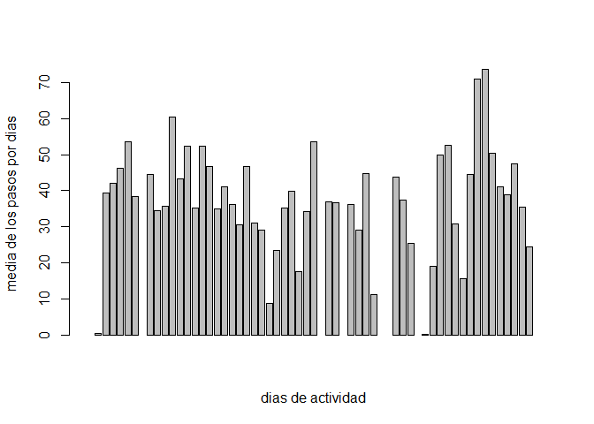
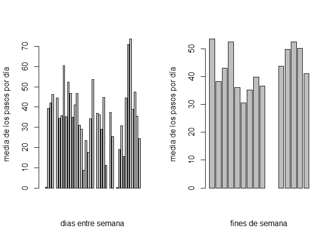
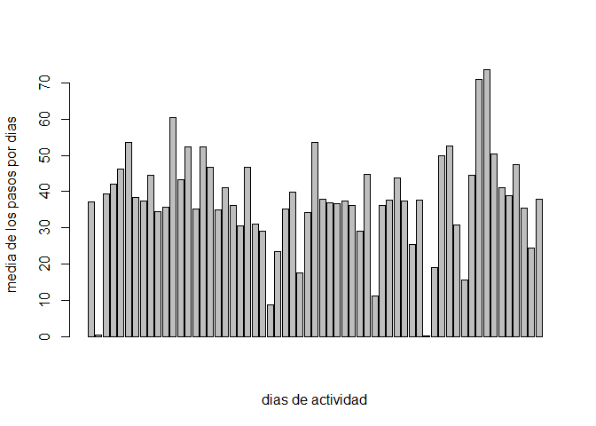

# Análisis de la actividad física
"Rosa Idalia Sánchez Hernández"  
18 de marzo de 2016  

**Introducción**

Con el fin de reducir el riesgo de enfermedades se recomienda la activación física aeróbica, de intensidad moderada. Se desea conocer los hábitos de una persona que no tiene mucho tiempo para ir al gimnasio, así que se estudia la cantidad de pasos que da en intervalos de 5 minutos durante dos meses. Después se desea comparar esta actividad física entre semana y los fines de semana.   

Para cargar los datos que se utilizaron, primero debemos fijar el directorio en donde se encuentran los datos, en este caso se guardaron en la variable activity.


```r
setwd("/Users/rosai/Documents/descargas lunes 14 marzo 2016/R markdown")
activity=read.csv("activity.csv")
```

En el siguiente cuadro podemos visualizar solo el encabezado de los datos tal como se registraron, la primer columna muestra el numero de pasos registrados, la segunda columna muestra la fecha en que se tomo la medición y la tercer columna contiene un identificador del intervalo. 

```r
print(head(activity))
```

```
##   steps       date interval
## 1    NA 2012-10-01        0
## 2    NA 2012-10-01        5
## 3    NA 2012-10-01       10
## 4    NA 2012-10-01       15
## 5    NA 2012-10-01       20
## 6    NA 2012-10-01       25
```


Procesamiento de los datos

Con la siguiente instrucción se desea conocer mas información acerca de la cantidad de veces que se repite la fecha, y posterior a eso se observa que el número de intervalos medidos por día es el mismo de 288. 
 Asi se decide reorganizar la información en una matriz de 288 filas y 61 columnas , cada columna son las mediciones tomadas en un dia diferente.
 

```r
info=table(activity[,2])  
pasos=matrix(activity[,1], nrow=288 , ncol = 61, byrow = FALSE)
```
A continuación se muestra la matriz con el reacomodo de los datos, pero como el archivo seria muy largo solo se mostraran para los primeros 12 días


```r
print(pasos[,1:12])
```

```
##        [,1] [,2] [,3] [,4] [,5] [,6] [,7] [,8] [,9] [,10] [,11] [,12]
##   [1,]   NA    0    0   47    0    0    0   NA    0    34     0     0
##   [2,]   NA    0    0    0    0    0    0   NA    0    18     0     0
##   [3,]   NA    0    0    0    0    0    0   NA    0     7     0     0
##   [4,]   NA    0    0    0    0    0    0   NA    0     0     8     0
##   [5,]   NA    0    0    0    0    0    0   NA    0     0     0     0
##   [6,]   NA    0    0    0    0    0    0   NA   13     0     0     0
##   [7,]   NA    0    0    0    0    0    0   NA   28     0     0     0
##   [8,]   NA    0    0    0    0    0    0   NA    0     0     0     0
##   [9,]   NA    0    0    0    0    0    0   NA    0     0     0     0
##  [10,]   NA    0    0    0    0    0    0   NA    0     0     0     0
##  [11,]   NA    0    0    0    0    0    0   NA    0     0     0     0
##  [12,]   NA    0    0    0    0    0    7   NA    0     0     0     0
##  [13,]   NA    0    0    0    0    0    0   NA    0     0     0     0
##  [14,]   NA    0    0    0    0    0   36   NA    0     0     0     0
##  [15,]   NA    0    0    0    0    0    0   NA    0     0     8     0
##  [16,]   NA    0    0    0    0    0    0   NA    0     0     0     0
##  [17,]   NA    0    0    0    0    0    0   NA    0     0     0     0
##  [18,]   NA    0    0    0    0    0    0   NA    0     0     0     0
##  [19,]   NA    0    0    0    0    0    8   NA    0     0     0    38
##  [20,]   NA    0    0    0    0    0    0   NA    0     0     0     0
##  [21,]   NA    0    0    0    0    0    0   NA    0     0     0     0
##  [22,]   NA    0    0    0    9    0   11   NA    0     0     0     0
##  [23,]   NA    0    0    0   14    0    0   NA    0     0     0     0
##  [24,]   NA    0    0    0    0    0    0   NA    0     0     0     0
##  [25,]   NA    0    0    0    0    0    0   NA    0     0     0     0
##  [26,]   NA    0    0    0    0    0    0   NA    0     0     0     0
##  [27,]   NA    0    0    0    0    0    0   NA   56     0     0     0
##  [28,]   NA    0    0    0    0    0    0   NA    0     0     0     0
##  [29,]   NA    0    0    0    0    0    0   NA    0     0     0     0
##  [30,]   NA    0    0    0    7    0    0   NA    0     0     0     0
##  [31,]   NA    0    0    0    0    0    0   NA    0     0     0     0
##  [32,]   NA    0    0    0    0    0    0   NA    0     0     0     0
##  [33,]   NA    0    0    0    0    0    0   NA    0     0     0     0
##  [34,]   NA    0    0    0    0    0    0   NA    0     0     0     0
##  [35,]   NA    0    0    0   27    0    0   NA    0     0     0     7
##  [36,]   NA    0    0    0    0    0    0   NA   50     0     0     0
##  [37,]   NA    0    0    0    0    0    0   NA    0     0     0     0
##  [38,]   NA    0    0    0    0    0    0   NA    0     0     0     0
##  [39,]   NA    0    0    0    0    0    0   NA    0     0     0     0
##  [40,]   NA    0    0    0    0    0    0   NA    0     0     0     0
##  [41,]   NA    0    0    0    0    0    0   NA    0     0     0     0
##  [42,]   NA    0    0    0    0    0    0   NA    0     0     0     0
##  [43,]   NA    0    0    0    0   40    0   NA    0     0     0     0
##  [44,]   NA    0    0    0    0   11    0   NA    0     0     0     0
##  [45,]   NA    0    0    0    0    0    0   NA    0     0     0     0
##  [46,]   NA    0    0    0    0    0    0   NA    0     0     0     0
##  [47,]   NA    0    0    0    0    0    0   NA    0     0     0     0
##  [48,]   NA    0    0    0    0    0    0   NA    0     0     0     0
##  [49,]   NA    0    0    0    0    0    0   NA    0     0     0     0
##  [50,]   NA    0    0    0   39    0    0   NA    0     0     0     0
##  [51,]   NA    0    4    0    0    0    0   NA   57     0     0     0
##  [52,]   NA    0    0    0    0    0    0   NA    0     0     0     0
##  [53,]   NA    0    0    0    0    0    0   NA    0     0     0     0
##  [54,]   NA    0    0    0    0   19    0   NA    0     0     0     0
##  [55,]   NA    0   36    0    0   67    0   NA    0     0     0    48
##  [56,]   NA    0    0    0    0    0    0   NA    0     0     0     0
##  [57,]   NA    0    0    0    0    0   36   NA    0     0   139     0
##  [58,]   NA    0    0    0    0    0    0   NA    0     0    15     0
##  [59,]   NA    0    0    0    0    0    0   NA    0     0     0     0
##  [60,]   NA    0    0    0    0    0    0   NA    0     0     0     0
##  [61,]   NA    0    0    0    0    0    0   NA    0     0     0     0
##  [62,]   NA    0    0    0   27    0    0   NA    0    34     0     0
##  [63,]   NA    0    0    7    0    0    0   NA    0     0     0     0
##  [64,]   NA    0    0   18    0    0    0   NA    0     0     0     0
##  [65,]   NA    0    0   57    0    0    0   NA    0     0     0     0
##  [66,]   NA    0    0   40    0    0    0   NA    0     0     0     0
##  [67,]   NA    0    0    0    0    0    0   NA    0     0     0     0
##  [68,]   NA    0   25    0    0    0    0   NA    0     0     0     0
##  [69,]   NA    0    0    0    0   27    0   NA    0     0     0    30
##  [70,]   NA    0    0    0    0    0    0   NA    4     0     0    92
##  [71,]   NA    0   90   16    0    0    0   NA    0     0     0     0
##  [72,]   NA    0  411    1   52    0    0   NA    0     0    11    11
##  [73,]   NA    0  413    0   36    0    0   NA    0     0     0     0
##  [74,]   NA    0  415   18    0    0    0   NA    0     7    10    10
##  [75,]   NA    0  519   20    0    0    0   NA    0     9    40    19
##  [76,]   NA    0  529   40   28   36   34   NA    8    36     0   111
##  [77,]   NA    0  613   36   67   50   13   NA    0     0     0    38
##  [78,]   NA    0  562   17  119   38    7   NA   13    47    32    16
##  [79,]   NA    0  612   49    7    0   71   NA   45    67    34    29
##  [80,]   NA    0  534   86   21    4    0   NA   25     0   105     9
##  [81,]   NA    0  323   49   29   42    0   NA   28    49    33    45
##  [82,]   NA    0  600    0   68   14   10   NA   15    23     8    35
##  [83,]   NA    0  533   29   29    8   29   NA   34    15    16    53
##  [84,]   NA    0  251   59    0  135   19   NA   63    29    18    43
##  [85,]   NA    0   56    7   11  172   30   NA   18    42     0     8
##  [86,]   NA    0    0   25   19  124    0   NA   62    49     9    40
##  [87,]   NA    0   32   30   84   31   43   NA   22    92     0     0
##  [88,]   NA    0   80   31   50   52    0   NA    0    28     0    32
##  [89,]   NA    0   10    7    2    0   99   NA   26    33    27    57
##  [90,]   NA    0    9   18   43  104   66   NA   19    63    22    35
##  [91,]   NA    0  145  113  126  170    0   NA    0    97     0   117
##  [92,]   NA    0   46  181   30   58    0   NA   10    90    50   117
##  [93,]   NA    0    0   87   19    0   43   NA   22   101     0    25
##  [94,]   NA    0   44    0    8    0   40   NA   18    55     0    95
##  [95,]   NA    0  126    0  171   75   19   NA  161    75     0    29
##  [96,]   NA    0   42    0   68    0   74   NA  146    40    23   141
##  [97,]   NA    0  138   57  114    0  121   NA   26    47    43    51
##  [98,]   NA    0   53   99    0  211   73   NA  257    22    70   123
##  [99,]   NA    0    0  507    9  321    0   NA  748    61   619   440
## [100,]   NA    0    0  522  122  149   27   NA  743     0   743   687
## [101,]   NA    0   22  510  400    0   99   NA  727     0   446   614
## [102,]   NA    0   57  519  451   82   58   NA  393     0   748   474
## [103,]   NA    0  161  508  371   94   62   NA  667     0   424   750
## [104,]   NA    0   19  423  470  225    0   NA  635     0   747   742
## [105,]   NA    0   15  499  473  216    0   NA  732     0   739   770
## [106,]   NA    0    0  259  512  199    0   NA  613    60   741   735
## [107,]   NA    0   16   31  449   50    0   NA  530    54   726   746
## [108,]   NA    0    0   17  496  187    0   NA  655    16   166   748
## [109,]   NA    0    0    0  530   30   23   NA  134   135   548   802
## [110,]   NA    0    8    0  509    0    0   NA    0    61   343   280
## [111,]   NA    0    0    0  252   65  223   NA    0    69    13    31
## [112,]   NA    0   51    0   84  173  312   NA   32    32    26     0
## [113,]   NA    0  516    0   16   43  106   NA   75     0    64     0
## [114,]   NA    0  245   17    0    0  284   NA  182     0     0     0
## [115,]   NA    0    0    0    6    0   88   NA    0    17     0     0
## [116,]   NA    0  161  145   46    0  124   NA    6     0     0     0
## [117,]   NA    0    7  453   39    0  102   NA    0     0     0     0
## [118,]   NA    0    0  229    0    0  230   NA   41    69     0     7
## [119,]   NA    0    0  144    0    0   78   NA    0     0     0    92
## [120,]   NA    0    0    0    0    0  207   NA    0    20     0     0
## [121,]   NA    0    0    0    0   16  281   NA   23   400     0     0
## [122,]   NA    0    0    0    0   26  247   NA    0   105     0     0
## [123,]   NA    0    0   82    0    0  235   NA   35   292     0     0
## [124,]   NA    0    0    0    0    0  334   NA  526   291     0     0
## [125,]   NA    0    0    0    0    0  389   NA    0    30     0    46
## [126,]   NA    0    0    0    0    0  414   NA    0     0     0     7
## [127,]   NA    0    0    0    0    0   88   NA  133     0     0     0
## [128,]   NA    0    0    0    0    0    0   NA   45    40     0   328
## [129,]   NA    0    0    0    0    0    0   NA    0    38     0   156
## [130,]   NA    0    0    0    0    0    0   NA    0     0     0     0
## [131,]   NA    0    0    0    0    0    0   NA    0     0     0     0
## [132,]   NA    0    0    0    0    0   19   NA   57     0     0     0
## [133,]   NA    0    0    0    0    0    0   NA    0     0     0   129
## [134,]   NA    0    0    0    0    0   16   NA    0     0     0   339
## [135,]   NA    0    0    0    0    0    0   NA    0     0     0   150
## [136,]   NA    0    0    0    0    0    0   NA    0    72     0     0
## [137,]   NA    0    0    0    0    0    0   NA    0    37     0     0
## [138,]   NA    0    0  180    0    0   68   NA    0     0     7     0
## [139,]   NA    0    0   21    0    0   64   NA    0     0    46    70
## [140,]   NA    0   72    0    0   95    0   NA    0    25     0     0
## [141,]   NA    0   73    0    0   64  118   NA    0    17     0     9
## [142,]   NA    0    0    0    0    7   26   NA    0     0     0     0
## [143,]   NA    0    0    0    0   33    0   NA    0     0     0     0
## [144,]   NA    0  116    0    0   72   34   NA   38    88     0     0
## [145,]   NA    0   97  160  138  221   18   NA  211     7     0    70
## [146,]   NA    0    0   79  541  439   34   NA  279   413     0     0
## [147,]   NA    0    0    0  555  519   28   NA   19   326     0     0
## [148,]   NA    0    0    0  345  440    0   NA   20    93    31     0
## [149,]   NA    0    0    0  345  394    0   NA   19   334    45     0
## [150,]   NA    0    0   46   10   97    0   NA    0   317     0     0
## [151,]   NA    0   15   66  485   71   37   NA    0     0     0     0
## [152,]   NA    0    0  127  515   10   40   NA    0     0     0     0
## [153,]   NA    0    0    0  168   87   35   NA    0     0     0    18
## [154,]   NA    0    0    0    0  443   53   NA    0     0     0    91
## [155,]   NA    0    0    0    0  500   15   NA    0    68     0     0
## [156,]   NA    0    0    0    0  465   12   NA    0   129     0     0
## [157,]   NA    0   80    0    0  485    0   NA    0     0     0     0
## [158,]   NA    0   69    0    0  351    0   NA    0     0     0    75
## [159,]   NA    0    0   31    0  515   16   NA    0     0     0     0
## [160,]   NA    0    0    0    0  511    0   NA    0     0     0     0
## [161,]   NA    0    0    0  349  506    0   NA    0     0     0     0
## [162,]   NA    0    0    0  341  486    0   NA    0     0     0     0
## [163,]   NA    0    0    0    0  171   44   NA  247     0     0    99
## [164,]   NA    0    0    0    0   12    0   NA  196     0     0     0
## [165,]   NA    0    0   28    0   24    0   NA  108     0     0     0
## [166,]   NA    0   99  496    0   42    0   NA  137     0     0     0
## [167,]   NA    0  100   78    0  140    0   NA    0     0     0     0
## [168,]   NA    0    0    0  158   15    0   NA    0     0     0    96
## [169,]   NA    0    0    0  545    0    0   NA    0     0     0    16
## [170,]   NA    0   33    0   82   43    0   NA   10     0     0    20
## [171,]   NA    0    0    0    0   67    0   NA    0   103     0   144
## [172,]   NA    0    0    0  105   48    0   NA    0   119     0   321
## [173,]   NA    0    7    0    0    0    0   NA    0     0     0   267
## [174,]   NA    0    0    0    0    0   11   NA    0     0     0     0
## [175,]   NA    0    0    0    0    9   11   NA    0     0    22     0
## [176,]   NA    0    0   77    0   31    0   NA    0    70    27     0
## [177,]   NA    0    0   20    0   30    0   NA    0   125     0     0
## [178,]   NA    0    0    7    0   64    0   NA    0     0     0     0
## [179,]   NA    0    0    1    0  115    0   NA    0     0     0     9
## [180,]   NA    0    0  128    0   25    0   NA    0     0     0     0
## [181,]   NA    0    0  354    0    0    0   NA    0     0     0     0
## [182,]   NA    0    0  310    0   27    0   NA    0     0     0    24
## [183,]   NA    0    0    0    0    0    0   NA    0     0     0    78
## [184,]   NA    0    0    0    0    0    0   NA    0     0     0     0
## [185,]   NA    0    0   25    0    0    0   NA    0     0     0    26
## [186,]   NA    0    0   15    0    0    0   NA    0     0     0    35
## [187,]   NA    0    0    0    0    0    0   NA    0   176    75     0
## [188,]   NA    0    0    0    0    0    0   NA    0    71   119     0
## [189,]   NA    0    0    0  326    0    0   NA    0    43   395     0
## [190,]   NA    0   88    0  172    0   80   NA   76   340    78   365
## [191,]   NA    0  154   33  332    0    0   NA    0     7   292    90
## [192,]   NA    0    0   33  402    0    0   NA    0    13   416   432
## [193,]   NA    0   20   32   70   27    0   NA    0    15    35   275
## [194,]   NA    0    0   66    0   27    0   NA   61     0     0    34
## [195,]   NA    0    0   77    0    0   12   NA   58     0     0     0
## [196,]   NA    0    0    0    0    0   25   NA    0     0    27    92
## [197,]   NA    0    0   44    0    9   30   NA    0     0    32    15
## [198,]   NA    0    0    0    0    0   50   NA    0     0     0     0
## [199,]   NA    0    0    0    0    0    0   NA    0     0     0     0
## [200,]   NA    0    0    0    0   54   83   NA    0     0     0     0
## [201,]   NA    0    0    0    0   35   13   NA    0     0     0     0
## [202,]   NA    0    0    0    0    0  146   NA    0     0     0    20
## [203,]   NA    0    0    0    0   49  422   NA   43     0    49    10
## [204,]   NA    0    0    0    0    0  453   NA    3    15    57     9
## [205,]   NA    0    0    0    0    0  411   NA    0    50    34     0
## [206,]   NA    0    0    0    0    0  439   NA    7   271     0     0
## [207,]   NA    0  198    0    0    0  523   NA   34   106     0    32
## [208,]   NA    0   61    0   53   93  413   NA   46   272     0    24
## [209,]   NA    0   75    0    0    0   13   NA  336   308     0     0
## [210,]   NA    0    0   40    0    0  165   NA  283     0     0     0
## [211,]   NA    0    0    0    0   13    0   NA    0     0    39    38
## [212,]   NA    0  193   37    0    0   79   NA    7   111    30    40
## [213,]   NA    0  298   90    0    6    7   NA    0   281     9    19
## [214,]   NA    0    0   53    0   12  142   NA    0    11    41    71
## [215,]   NA    0   15   73    7    0  107   NA    0   139     7     2
## [216,]   NA    0   21   92   10    0    0   NA    0    36     0    21
## [217,]   NA    0    0  285   65   34   90   NA    0     0     0     0
## [218,]   NA    0    0  527   40   77   17   NA    0     0    40   433
## [219,]   NA    0    0  531   15  173   18   NA   75     0    22   463
## [220,]   NA    0    0  547   29  370   61   NA   82     0    31   511
## [221,]   NA    0   51  175    0  402    0   NA    0     0    19   298
## [222,]   NA    0   36  114   20  504    0   NA   33     0     0   500
## [223,]   NA    0    0   62   35  485    0   NA   24    58     8   473
## [224,]   NA    0   26    0   69  437   80   NA   61    63    22   506
## [225,]   NA    0   22   59   25  526  190   NA   16   260    62    24
## [226,]   NA    0    0   65   46  264   82   NA   76    82    60    35
## [227,]   NA    0   39    0   15    0   51   NA   33   310     0    41
## [228,]   NA    0   52  101   26   35   30   NA    0     0     0    46
## [229,]   NA    0   15   43   33  124   23   NA    0     0     0     0
## [230,]   NA    0   41    0   58   93   51   NA   57     0     0     0
## [231,]   NA    0    0    0   75    0   31   NA    0     8     0     0
## [232,]   NA    0   42    0   59    0    0   NA    0    12     0    16
## [233,]   NA    0    0   49    0    0    7   NA    0   364     0    23
## [234,]   NA    0    0   21    0    0   49   NA    0   219     0     0
## [235,]   NA    0  159    0    0    0    0   NA    0     0     0     0
## [236,]   NA    0   32   16    0    0    0   NA    0     0     0     0
## [237,]   NA    0    0   56    0    0    0   NA    0     0     0    18
## [238,]   NA    0    0    0    0    0    0   NA    0   174     0    54
## [239,]   NA    0    0    0    0    0    0   NA    0   205     0    36
## [240,]   NA    0    0    0    0    0    0   NA    0    12     0     0
## [241,]   NA    0   34    0    0    0    0   NA    0     0     0     0
## [242,]   NA    0    0    0    0    0    0   NA    0     0     0     0
## [243,]   NA    0    0    0    0   33   42   NA    0    11     0     0
## [244,]   NA    0    0    0    0  118  175   NA   81    17     0     0
## [245,]   NA    0    0    0    0    0  170   NA   48     0     0     0
## [246,]   NA    0   36    0    0    6    0   NA    0     0     0     0
## [247,]   NA    0   73    0    0    0  290   NA    0    37     0     0
## [248,]   NA    0    9    0   71  262    0   NA    0     0     0     0
## [249,]   NA    0    0   17    0   33    0   NA    0     0     0     0
## [250,]   NA    0    0   15    0   46    0   NA    0   105     0    18
## [251,]   NA    0    0    0    0   35   36   NA    0    34     0    30
## [252,]   NA    0    0    0    0    0    0   NA    0     0     0    23
## [253,]   NA    0    0   27    0    0  117   NA   31   152     0    70
## [254,]   NA    0    0  106    0    0   72   NA   15     0     0   113
## [255,]   NA    0    0  122    0    0   52   NA  138     0    95     0
## [256,]   NA    0    0   41    0    0    8   NA   88     0     0     0
## [257,]   NA    0    0   35    0    0    0   NA    0     0    91     0
## [258,]   NA    0    0    6    0    0    0   NA   14     0    50     0
## [259,]   NA    0   90    0    0    0    0   NA   36     0    31     0
## [260,]   NA    0  128    0    0    0    0   NA  102     0     0     0
## [261,]   NA    0   46   68    0    0    0   NA   14     0     0     0
## [262,]   NA    0    0    0    0    0   61   NA  279     0     0     0
## [263,]   NA    0    0    0    0    0    0   NA  153     0    20     0
## [264,]   NA    0    0    0    0    0    0   NA    0     0    11     0
## [265,]   NA    0    0    0    0    0    0   NA    0     0     0     0
## [266,]   NA    0    0    0    0    0    0   NA  109     0     0     0
## [267,]   NA  117    0    0    0    0    0   NA    0     0     0     0
## [268,]   NA    9    0    0    0    0    0   NA    0   112     0     9
## [269,]   NA    0    0    0    0    0    0   NA    0    23     0     0
## [270,]   NA    0    0    0    0    0    0   NA   14    12     0     0
## [271,]   NA    0    0    0    0    0    0   NA   16     8     0     8
## [272,]   NA    0    0    0    0    0    0   NA    0     0     0     0
## [273,]   NA    0    0    0    0    0    0   NA    0     0     0     0
## [274,]   NA    0    0    0    0    0    0   NA    0     0     0     0
## [275,]   NA    0    0    0    0    0    0   NA    0     0     0     0
## [276,]   NA    0    0    0    0    0    0   NA    0     0     0     0
## [277,]   NA    0    0    0    0    0    0   NA    0     7    11     0
## [278,]   NA    0    0    0    0    0    0   NA    0     0     0     0
## [279,]   NA    0    0    0    0    0    0   NA    0     0     0     0
## [280,]   NA    0    0    0    0    0    0   NA    0     0     0     0
## [281,]   NA    0    0    0    0    0    0   NA    0     0     0     0
## [282,]   NA    0    0    0    0    0    0   NA    0     0     4     0
## [283,]   NA    0    0    0    0    0    0   NA    0     0     0     0
## [284,]   NA    0    0    0    0    0    0   NA    0     0     0     0
## [285,]   NA    0    0    0    0    0    0   NA    0     0     0     0
## [286,]   NA    0    8    0    0    0    0   NA    0     0     0     0
## [287,]   NA    0    0    0    0    0    0   NA    0     8     0     0
## [288,]   NA    0    0    0    0    0    0   NA   20     0     0     0
```

Con los datos ya reacomodados calculamos la media y la mediana de los datos por día, con las siguientes instrucciones 


```r
media=rep(0,61)
mediana=rep(0,61)
for (i in 1:61)
{media[i]=mean(pasos[,i])
mediana[i]=median(pasos[,i])}
```

```r
print(media)
```

```
##  [1]         NA  0.4375000 39.4166667 42.0694444 46.1597222 53.5416667
##  [7] 38.2465278         NA 44.4826389 34.3750000 35.7777778 60.3541667
## [13] 43.1458333 52.4236111 35.2048611 52.3750000 46.7083333 34.9166667
## [19] 41.0729167 36.0937500 30.6284722 46.7361111 30.9652778 29.0104167
## [25]  8.6527778 23.5347222 35.1354167 39.7847222 17.4236111 34.0937500
## [31] 53.5208333         NA 36.8055556 36.7048611         NA 36.2465278
## [37] 28.9375000 44.7326389 11.1770833         NA         NA 43.7777778
## [43] 37.3784722 25.4722222         NA  0.1423611 18.8923611 49.7881944
## [49] 52.4652778 30.6979167 15.5277778 44.3993056 70.9270833 73.5902778
## [55] 50.2708333 41.0902778 38.7569444 47.3819444 35.3576389 24.4687500
## [61]         NA
```

```r
print(mediana)
```

```
##  [1] NA  0  0  0  0  0  0 NA  0  0  0  0  0  0  0  0  0  0  0  0  0  0  0
## [24]  0  0  0  0  0  0  0  0 NA  0  0 NA  0  0  0  0 NA NA  0  0  0 NA  0
## [47]  0  0  0  0  0  0  0  0  0  0  0  0  0  0 NA
```

Visualicemos la siguiente gráfica de barras en donde se muestra la media de la cantidad de pasos registrados por cada dia 



Se crearon una lista de los índices en que cambia la fecha para manipularlos de forma posterior


```r
dias=(1:61)  
dias=dias*288;
```

Con la siguiente instrucción se reconoce el formato de la segunda columna de la matriz activity como fechas y con el comando weekdays se puede obtener el día de la semana asociado a cada una de las fechas 


```r
today<-as.Date(activity[dias,2])
dias2=weekdays(today, abbreviate = FALSE)
```


Se crean los siguientes arreglos para guardar las medias correspondientes a los fines de semana y las correspondientes a los días entre semana 


```r
findesem=media[which((dias2=="sábado" | dias2=="domingo"))]
entresem=media[-which((dias2=="sábado" | dias2=="domingo"))]
```

A continuación se grafican las medias entre semana y en fin de semana


```r
par(mfrow=c(1,2))
barplot(entresem , ylab="media de los pasos por día", xlab="dias entre semana")
barplot(findesem, ylab="media de los pasos por día", xlab="fines de semana")
```



Para comparar las dos poblaciones se crea una prueba t-student con la  finalidad de ver si hay diferencia una diferencia significativa entre la cantidad de pasos que se dan entre semana y en fin de semana con la siguiente intruccion


```r
t.test(entresem,findesem) 
```

```
## 
## 	Welch Two Sample t-test
## 
## data:  entresem and findesem
## t = -2.3552, df = 47.662, p-value = 0.02268
## alternative hypothesis: true difference in means is not equal to 0
## 95 percent confidence interval:
##  -14.34970  -1.13112
## sample estimates:
## mean of x mean of y 
##  35.33796  43.07837
```

La hipotesis nula es que las dos medias son iguales. Como el p-valor es 0.02 con este p-valor puedes rechazar la hipotesis nula a un 95 % de confianza. Ademas como el intervalo es negativo esto indica que en fin de semana se camina mas que entre semana.


En la lista de los datos se puede observar que existen valores NA , lo cual indica que ese día no se registró informacion correspondiente al numero de pasos. Se utilizará la siguiente instrucción para identificar la posición de estos valores "NA".

```r
datos_na=which(is.na(activity[,1]))
```


Para reemplazarlos se utilizará una función de Poisson con la media de los datos que se tienen como parametro "mu", esto se realiza con la función rpois como se muestra a continuación. 


```r
mu=mean(activity[-datos_na,1])
n_na=length(datos_na)  
list_poisson=rpois(n_na,mu)
```


Se crea una copia del registro de los pasos en donde se reemplazaran los datos con NA

```r
activity_copia=activity
activity_copia[datos_na,1]=list_poisson
```

Veamos como quedan los datos una vez que se sustituyeron los valores NA, mostrando solo el encabezado de los datos.

```r
head(activity_copia)
```

```
##   steps       date interval
## 1    39 2012-10-01        0
## 2    31 2012-10-01        5
## 3    40 2012-10-01       10
## 4    41 2012-10-01       15
## 5    45 2012-10-01       20
## 6    35 2012-10-01       25
```

Como se realizó anteriormente se crea una matriz con el reacomodo de los datos, pero como el archivo seria muy largo solo se mostrarán para los primeros 12 dias

```r
pasos_2=matrix(activity_copia[,1], nrow=288 , ncol = 61, byrow = FALSE)
pasos_2[,1:12]
```

```
##        [,1] [,2] [,3] [,4] [,5] [,6] [,7] [,8] [,9] [,10] [,11] [,12]
##   [1,]   39    0    0   47    0    0    0   42    0    34     0     0
##   [2,]   31    0    0    0    0    0    0   50    0    18     0     0
##   [3,]   40    0    0    0    0    0    0   40    0     7     0     0
##   [4,]   41    0    0    0    0    0    0   32    0     0     8     0
##   [5,]   45    0    0    0    0    0    0   41    0     0     0     0
##   [6,]   35    0    0    0    0    0    0   32   13     0     0     0
##   [7,]   48    0    0    0    0    0    0   40   28     0     0     0
##   [8,]   39    0    0    0    0    0    0   29    0     0     0     0
##   [9,]   32    0    0    0    0    0    0   20    0     0     0     0
##  [10,]   41    0    0    0    0    0    0   46    0     0     0     0
##  [11,]   34    0    0    0    0    0    0   48    0     0     0     0
##  [12,]   35    0    0    0    0    0    7   34    0     0     0     0
##  [13,]   36    0    0    0    0    0    0   43    0     0     0     0
##  [14,]   46    0    0    0    0    0   36   40    0     0     0     0
##  [15,]   30    0    0    0    0    0    0   29    0     0     8     0
##  [16,]   38    0    0    0    0    0    0   42    0     0     0     0
##  [17,]   41    0    0    0    0    0    0   31    0     0     0     0
##  [18,]   42    0    0    0    0    0    0   45    0     0     0     0
##  [19,]   36    0    0    0    0    0    8   31    0     0     0    38
##  [20,]   39    0    0    0    0    0    0   38    0     0     0     0
##  [21,]   32    0    0    0    0    0    0   43    0     0     0     0
##  [22,]   33    0    0    0    9    0   11   28    0     0     0     0
##  [23,]   39    0    0    0   14    0    0   30    0     0     0     0
##  [24,]   28    0    0    0    0    0    0   47    0     0     0     0
##  [25,]   38    0    0    0    0    0    0   46    0     0     0     0
##  [26,]   27    0    0    0    0    0    0   43    0     0     0     0
##  [27,]   35    0    0    0    0    0    0   34   56     0     0     0
##  [28,]   29    0    0    0    0    0    0   28    0     0     0     0
##  [29,]   33    0    0    0    0    0    0   35    0     0     0     0
##  [30,]   38    0    0    0    7    0    0   38    0     0     0     0
##  [31,]   34    0    0    0    0    0    0   33    0     0     0     0
##  [32,]   35    0    0    0    0    0    0   34    0     0     0     0
##  [33,]   33    0    0    0    0    0    0   31    0     0     0     0
##  [34,]   33    0    0    0    0    0    0   30    0     0     0     0
##  [35,]   34    0    0    0   27    0    0   45    0     0     0     7
##  [36,]   43    0    0    0    0    0    0   33   50     0     0     0
##  [37,]   48    0    0    0    0    0    0   36    0     0     0     0
##  [38,]   34    0    0    0    0    0    0   37    0     0     0     0
##  [39,]   42    0    0    0    0    0    0   43    0     0     0     0
##  [40,]   26    0    0    0    0    0    0   41    0     0     0     0
##  [41,]   49    0    0    0    0    0    0   40    0     0     0     0
##  [42,]   37    0    0    0    0    0    0   43    0     0     0     0
##  [43,]   35    0    0    0    0   40    0   45    0     0     0     0
##  [44,]   27    0    0    0    0   11    0   31    0     0     0     0
##  [45,]   41    0    0    0    0    0    0   27    0     0     0     0
##  [46,]   42    0    0    0    0    0    0   32    0     0     0     0
##  [47,]   29    0    0    0    0    0    0   43    0     0     0     0
##  [48,]   35    0    0    0    0    0    0   47    0     0     0     0
##  [49,]   30    0    0    0    0    0    0   25    0     0     0     0
##  [50,]   38    0    0    0   39    0    0   41    0     0     0     0
##  [51,]   38    0    4    0    0    0    0   37   57     0     0     0
##  [52,]   30    0    0    0    0    0    0   40    0     0     0     0
##  [53,]   44    0    0    0    0    0    0   26    0     0     0     0
##  [54,]   44    0    0    0    0   19    0   43    0     0     0     0
##  [55,]   37    0   36    0    0   67    0   42    0     0     0    48
##  [56,]   39    0    0    0    0    0    0   33    0     0     0     0
##  [57,]   43    0    0    0    0    0   36   40    0     0   139     0
##  [58,]   35    0    0    0    0    0    0   34    0     0    15     0
##  [59,]   37    0    0    0    0    0    0   41    0     0     0     0
##  [60,]   35    0    0    0    0    0    0   32    0     0     0     0
##  [61,]   41    0    0    0    0    0    0   34    0     0     0     0
##  [62,]   38    0    0    0   27    0    0   31    0    34     0     0
##  [63,]   37    0    0    7    0    0    0   42    0     0     0     0
##  [64,]   37    0    0   18    0    0    0   35    0     0     0     0
##  [65,]   45    0    0   57    0    0    0   45    0     0     0     0
##  [66,]   44    0    0   40    0    0    0   44    0     0     0     0
##  [67,]   36    0    0    0    0    0    0   39    0     0     0     0
##  [68,]   40    0   25    0    0    0    0   41    0     0     0     0
##  [69,]   34    0    0    0    0   27    0   33    0     0     0    30
##  [70,]   35    0    0    0    0    0    0   41    4     0     0    92
##  [71,]   38    0   90   16    0    0    0   41    0     0     0     0
##  [72,]   33    0  411    1   52    0    0   31    0     0    11    11
##  [73,]   41    0  413    0   36    0    0   33    0     0     0     0
##  [74,]   36    0  415   18    0    0    0   47    0     7    10    10
##  [75,]   29    0  519   20    0    0    0   27    0     9    40    19
##  [76,]   40    0  529   40   28   36   34   29    8    36     0   111
##  [77,]   41    0  613   36   67   50   13   30    0     0     0    38
##  [78,]   40    0  562   17  119   38    7   30   13    47    32    16
##  [79,]   29    0  612   49    7    0   71   43   45    67    34    29
##  [80,]   40    0  534   86   21    4    0   33   25     0   105     9
##  [81,]   36    0  323   49   29   42    0   45   28    49    33    45
##  [82,]   38    0  600    0   68   14   10   45   15    23     8    35
##  [83,]   46    0  533   29   29    8   29   41   34    15    16    53
##  [84,]   31    0  251   59    0  135   19   53   63    29    18    43
##  [85,]   34    0   56    7   11  172   30   37   18    42     0     8
##  [86,]   35    0    0   25   19  124    0   23   62    49     9    40
##  [87,]   37    0   32   30   84   31   43   36   22    92     0     0
##  [88,]   33    0   80   31   50   52    0   41    0    28     0    32
##  [89,]   32    0   10    7    2    0   99   35   26    33    27    57
##  [90,]   35    0    9   18   43  104   66   53   19    63    22    35
##  [91,]   24    0  145  113  126  170    0   42    0    97     0   117
##  [92,]   36    0   46  181   30   58    0   47   10    90    50   117
##  [93,]   32    0    0   87   19    0   43   39   22   101     0    25
##  [94,]   36    0   44    0    8    0   40   35   18    55     0    95
##  [95,]   40    0  126    0  171   75   19   49  161    75     0    29
##  [96,]   38    0   42    0   68    0   74   33  146    40    23   141
##  [97,]   29    0  138   57  114    0  121   51   26    47    43    51
##  [98,]   31    0   53   99    0  211   73   28  257    22    70   123
##  [99,]   28    0    0  507    9  321    0   36  748    61   619   440
## [100,]   43    0    0  522  122  149   27   49  743     0   743   687
## [101,]   47    0   22  510  400    0   99   34  727     0   446   614
## [102,]   47    0   57  519  451   82   58   43  393     0   748   474
## [103,]   38    0  161  508  371   94   62   29  667     0   424   750
## [104,]   32    0   19  423  470  225    0   49  635     0   747   742
## [105,]   37    0   15  499  473  216    0   38  732     0   739   770
## [106,]   40    0    0  259  512  199    0   48  613    60   741   735
## [107,]   38    0   16   31  449   50    0   37  530    54   726   746
## [108,]   40    0    0   17  496  187    0   36  655    16   166   748
## [109,]   42    0    0    0  530   30   23   37  134   135   548   802
## [110,]   42    0    8    0  509    0    0   34    0    61   343   280
## [111,]   46    0    0    0  252   65  223   44    0    69    13    31
## [112,]   39    0   51    0   84  173  312   28   32    32    26     0
## [113,]   38    0  516    0   16   43  106   40   75     0    64     0
## [114,]   31    0  245   17    0    0  284   30  182     0     0     0
## [115,]   35    0    0    0    6    0   88   41    0    17     0     0
## [116,]   52    0  161  145   46    0  124   44    6     0     0     0
## [117,]   24    0    7  453   39    0  102   40    0     0     0     0
## [118,]   32    0    0  229    0    0  230   34   41    69     0     7
## [119,]   30    0    0  144    0    0   78   48    0     0     0    92
## [120,]   37    0    0    0    0    0  207   39    0    20     0     0
## [121,]   24    0    0    0    0   16  281   40   23   400     0     0
## [122,]   41    0    0    0    0   26  247   47    0   105     0     0
## [123,]   30    0    0   82    0    0  235   39   35   292     0     0
## [124,]   29    0    0    0    0    0  334   42  526   291     0     0
## [125,]   31    0    0    0    0    0  389   31    0    30     0    46
## [126,]   36    0    0    0    0    0  414   41    0     0     0     7
## [127,]   38    0    0    0    0    0   88   42  133     0     0     0
## [128,]   36    0    0    0    0    0    0   43   45    40     0   328
## [129,]   42    0    0    0    0    0    0   40    0    38     0   156
## [130,]   41    0    0    0    0    0    0   37    0     0     0     0
## [131,]   26    0    0    0    0    0    0   47    0     0     0     0
## [132,]   37    0    0    0    0    0   19   28   57     0     0     0
## [133,]   40    0    0    0    0    0    0   28    0     0     0   129
## [134,]   33    0    0    0    0    0   16   35    0     0     0   339
## [135,]   37    0    0    0    0    0    0   43    0     0     0   150
## [136,]   42    0    0    0    0    0    0   37    0    72     0     0
## [137,]   45    0    0    0    0    0    0   47    0    37     0     0
## [138,]   30    0    0  180    0    0   68   34    0     0     7     0
## [139,]   47    0    0   21    0    0   64   47    0     0    46    70
## [140,]   34    0   72    0    0   95    0   35    0    25     0     0
## [141,]   29    0   73    0    0   64  118   42    0    17     0     9
## [142,]   32    0    0    0    0    7   26   41    0     0     0     0
## [143,]   45    0    0    0    0   33    0   37    0     0     0     0
## [144,]   32    0  116    0    0   72   34   37   38    88     0     0
## [145,]   37    0   97  160  138  221   18   43  211     7     0    70
## [146,]   46    0    0   79  541  439   34   43  279   413     0     0
## [147,]   45    0    0    0  555  519   28   37   19   326     0     0
## [148,]   35    0    0    0  345  440    0   52   20    93    31     0
## [149,]   37    0    0    0  345  394    0   34   19   334    45     0
## [150,]   44    0    0   46   10   97    0   34    0   317     0     0
## [151,]   33    0   15   66  485   71   37   41    0     0     0     0
## [152,]   30    0    0  127  515   10   40   39    0     0     0     0
## [153,]   45    0    0    0  168   87   35   29    0     0     0    18
## [154,]   42    0    0    0    0  443   53   30    0     0     0    91
## [155,]   32    0    0    0    0  500   15   34    0    68     0     0
## [156,]   38    0    0    0    0  465   12   26    0   129     0     0
## [157,]   46    0   80    0    0  485    0   37    0     0     0     0
## [158,]   31    0   69    0    0  351    0   42    0     0     0    75
## [159,]   37    0    0   31    0  515   16   35    0     0     0     0
## [160,]   24    0    0    0    0  511    0   33    0     0     0     0
## [161,]   37    0    0    0  349  506    0   32    0     0     0     0
## [162,]   35    0    0    0  341  486    0   30    0     0     0     0
## [163,]   43    0    0    0    0  171   44   41  247     0     0    99
## [164,]   30    0    0    0    0   12    0   47  196     0     0     0
## [165,]   35    0    0   28    0   24    0   31  108     0     0     0
## [166,]   34    0   99  496    0   42    0   37  137     0     0     0
## [167,]   41    0  100   78    0  140    0   54    0     0     0     0
## [168,]   35    0    0    0  158   15    0   33    0     0     0    96
## [169,]   42    0    0    0  545    0    0   41    0     0     0    16
## [170,]   33    0   33    0   82   43    0   40   10     0     0    20
## [171,]   38    0    0    0    0   67    0   33    0   103     0   144
## [172,]   39    0    0    0  105   48    0   41    0   119     0   321
## [173,]   41    0    7    0    0    0    0   29    0     0     0   267
## [174,]   41    0    0    0    0    0   11   32    0     0     0     0
## [175,]   25    0    0    0    0    9   11   30    0     0    22     0
## [176,]   37    0    0   77    0   31    0   28    0    70    27     0
## [177,]   46    0    0   20    0   30    0   48    0   125     0     0
## [178,]   29    0    0    7    0   64    0   31    0     0     0     0
## [179,]   41    0    0    1    0  115    0   35    0     0     0     9
## [180,]   26    0    0  128    0   25    0   28    0     0     0     0
## [181,]   33    0    0  354    0    0    0   47    0     0     0     0
## [182,]   46    0    0  310    0   27    0   48    0     0     0    24
## [183,]   37    0    0    0    0    0    0   36    0     0     0    78
## [184,]   33    0    0    0    0    0    0   49    0     0     0     0
## [185,]   35    0    0   25    0    0    0   30    0     0     0    26
## [186,]   40    0    0   15    0    0    0   33    0     0     0    35
## [187,]   29    0    0    0    0    0    0   40    0   176    75     0
## [188,]   32    0    0    0    0    0    0   30    0    71   119     0
## [189,]   29    0    0    0  326    0    0   37    0    43   395     0
## [190,]   32    0   88    0  172    0   80   38   76   340    78   365
## [191,]   34    0  154   33  332    0    0   37    0     7   292    90
## [192,]   30    0    0   33  402    0    0   30    0    13   416   432
## [193,]   37    0   20   32   70   27    0   41    0    15    35   275
## [194,]   46    0    0   66    0   27    0   45   61     0     0    34
## [195,]   48    0    0   77    0    0   12   43   58     0     0     0
## [196,]   42    0    0    0    0    0   25   35    0     0    27    92
## [197,]   38    0    0   44    0    9   30   38    0     0    32    15
## [198,]   32    0    0    0    0    0   50   39    0     0     0     0
## [199,]   37    0    0    0    0    0    0   35    0     0     0     0
## [200,]   30    0    0    0    0   54   83   37    0     0     0     0
## [201,]   36    0    0    0    0   35   13   33    0     0     0     0
## [202,]   45    0    0    0    0    0  146   35    0     0     0    20
## [203,]   35    0    0    0    0   49  422   45   43     0    49    10
## [204,]   40    0    0    0    0    0  453   34    3    15    57     9
## [205,]   31    0    0    0    0    0  411   36    0    50    34     0
## [206,]   39    0    0    0    0    0  439   38    7   271     0     0
## [207,]   33    0  198    0    0    0  523   34   34   106     0    32
## [208,]   42    0   61    0   53   93  413   41   46   272     0    24
## [209,]   48    0   75    0    0    0   13   28  336   308     0     0
## [210,]   50    0    0   40    0    0  165   34  283     0     0     0
## [211,]   27    0    0    0    0   13    0   42    0     0    39    38
## [212,]   48    0  193   37    0    0   79   38    7   111    30    40
## [213,]   43    0  298   90    0    6    7   27    0   281     9    19
## [214,]   31    0    0   53    0   12  142   34    0    11    41    71
## [215,]   18    0   15   73    7    0  107   26    0   139     7     2
## [216,]   43    0   21   92   10    0    0   41    0    36     0    21
## [217,]   26    0    0  285   65   34   90   35    0     0     0     0
## [218,]   33    0    0  527   40   77   17   36    0     0    40   433
## [219,]   31    0    0  531   15  173   18   41   75     0    22   463
## [220,]   37    0    0  547   29  370   61   45   82     0    31   511
## [221,]   39    0   51  175    0  402    0   43    0     0    19   298
## [222,]   42    0   36  114   20  504    0   41   33     0     0   500
## [223,]   32    0    0   62   35  485    0   31   24    58     8   473
## [224,]   38    0   26    0   69  437   80   30   61    63    22   506
## [225,]   31    0   22   59   25  526  190   39   16   260    62    24
## [226,]   38    0    0   65   46  264   82   34   76    82    60    35
## [227,]   56    0   39    0   15    0   51   33   33   310     0    41
## [228,]   45    0   52  101   26   35   30   40    0     0     0    46
## [229,]   53    0   15   43   33  124   23   38    0     0     0     0
## [230,]   44    0   41    0   58   93   51   39   57     0     0     0
## [231,]   30    0    0    0   75    0   31   32    0     8     0     0
## [232,]   37    0   42    0   59    0    0   39    0    12     0    16
## [233,]   23    0    0   49    0    0    7   32    0   364     0    23
## [234,]   41    0    0   21    0    0   49   44    0   219     0     0
## [235,]   37    0  159    0    0    0    0   27    0     0     0     0
## [236,]   47    0   32   16    0    0    0   38    0     0     0     0
## [237,]   43    0    0   56    0    0    0   37    0     0     0    18
## [238,]   37    0    0    0    0    0    0   43    0   174     0    54
## [239,]   29    0    0    0    0    0    0   35    0   205     0    36
## [240,]   43    0    0    0    0    0    0   28    0    12     0     0
## [241,]   47    0   34    0    0    0    0   41    0     0     0     0
## [242,]   36    0    0    0    0    0    0   41    0     0     0     0
## [243,]   39    0    0    0    0   33   42   23    0    11     0     0
## [244,]   38    0    0    0    0  118  175   27   81    17     0     0
## [245,]   40    0    0    0    0    0  170   32   48     0     0     0
## [246,]   41    0   36    0    0    6    0   55    0     0     0     0
## [247,]   37    0   73    0    0    0  290   37    0    37     0     0
## [248,]   41    0    9    0   71  262    0   31    0     0     0     0
## [249,]   38    0    0   17    0   33    0   32    0     0     0     0
## [250,]   28    0    0   15    0   46    0   40    0   105     0    18
## [251,]   41    0    0    0    0   35   36   37    0    34     0    30
## [252,]   36    0    0    0    0    0    0   38    0     0     0    23
## [253,]   29    0    0   27    0    0  117   31   31   152     0    70
## [254,]   30    0    0  106    0    0   72   45   15     0     0   113
## [255,]   32    0    0  122    0    0   52   35  138     0    95     0
## [256,]   38    0    0   41    0    0    8   38   88     0     0     0
## [257,]   46    0    0   35    0    0    0   35    0     0    91     0
## [258,]   37    0    0    6    0    0    0   37   14     0    50     0
## [259,]   31    0   90    0    0    0    0   31   36     0    31     0
## [260,]   57    0  128    0    0    0    0   41  102     0     0     0
## [261,]   42    0   46   68    0    0    0   41   14     0     0     0
## [262,]   45    0    0    0    0    0   61   48  279     0     0     0
## [263,]   31    0    0    0    0    0    0   40  153     0    20     0
## [264,]   47    0    0    0    0    0    0   36    0     0    11     0
## [265,]   29    0    0    0    0    0    0   30    0     0     0     0
## [266,]   40    0    0    0    0    0    0   30  109     0     0     0
## [267,]   38  117    0    0    0    0    0   30    0     0     0     0
## [268,]   34    9    0    0    0    0    0   44    0   112     0     9
## [269,]   42    0    0    0    0    0    0   39    0    23     0     0
## [270,]   31    0    0    0    0    0    0   42   14    12     0     0
## [271,]   36    0    0    0    0    0    0   35   16     8     0     8
## [272,]   40    0    0    0    0    0    0   43    0     0     0     0
## [273,]   41    0    0    0    0    0    0   33    0     0     0     0
## [274,]   38    0    0    0    0    0    0   37    0     0     0     0
## [275,]   33    0    0    0    0    0    0   33    0     0     0     0
## [276,]   36    0    0    0    0    0    0   45    0     0     0     0
## [277,]   62    0    0    0    0    0    0   36    0     7    11     0
## [278,]   42    0    0    0    0    0    0   28    0     0     0     0
## [279,]   43    0    0    0    0    0    0   38    0     0     0     0
## [280,]   38    0    0    0    0    0    0   34    0     0     0     0
## [281,]   36    0    0    0    0    0    0   28    0     0     0     0
## [282,]   53    0    0    0    0    0    0   36    0     0     4     0
## [283,]   39    0    0    0    0    0    0   29    0     0     0     0
## [284,]   38    0    0    0    0    0    0   34    0     0     0     0
## [285,]   37    0    0    0    0    0    0   39    0     0     0     0
## [286,]   41    0    8    0    0    0    0   26    0     0     0     0
## [287,]   45    0    0    0    0    0    0   44    0     8     0     0
## [288,]   36    0    0    0    0    0    0   30   20     0     0     0
```

Se calcula la media y la mediana por dia para estos datos y podemos observar que ya no aparece ningún NA como sucedió anteriormente

```r
media_2=rep(0,61)
mediana_2=rep(0,61)
for (i in 1:61)
{media_2[i]=mean(pasos_2[,i])
mediana_2[i]=median(pasos_2[,i])}
```


```r
print(media_2)
```

```
##  [1] 37.2395833  0.4375000 39.4166667 42.0694444 46.1597222 53.5416667
##  [7] 38.2465278 37.3229167 44.4826389 34.3750000 35.7777778 60.3541667
## [13] 43.1458333 52.4236111 35.2048611 52.3750000 46.7083333 34.9166667
## [19] 41.0729167 36.0937500 30.6284722 46.7361111 30.9652778 29.0104167
## [25]  8.6527778 23.5347222 35.1354167 39.7847222 17.4236111 34.0937500
## [31] 53.5208333 37.8784722 36.8055556 36.7048611 37.3750000 36.2465278
## [37] 28.9375000 44.7326389 11.1770833 36.2048611 37.5972222 43.7777778
## [43] 37.3784722 25.4722222 37.6284722  0.1423611 18.8923611 49.7881944
## [49] 52.4652778 30.6979167 15.5277778 44.3993056 70.9270833 73.5902778
## [55] 50.2708333 41.0902778 38.7569444 47.3819444 35.3576389 24.4687500
## [61] 37.7534722
```

```r
print(mediana_2)
```

```
##  [1] 37  0  0  0  0  0  0 37  0  0  0  0  0  0  0  0  0  0  0  0  0  0  0
## [24]  0  0  0  0  0  0  0  0 38  0  0 37  0  0  0  0 36 37  0  0  0 37  0
## [47]  0  0  0  0  0  0  0  0  0  0  0  0  0  0 38
```

Veamos la gráfica de actividad diaria

```r
par(mfrow=c(1,1))
barplot(media_2, ylab="media de los pasos por dias", xlab="dias de actividad")
```



Realizaremos una prueba t-student entre los datos con NA y los datos en los que NA se sustituyó

```r
t.test(media,media_2)
```

```
## 
## 	Welch Two Sample t-test
## 
## data:  media and media_2
## t = 0.00036968, df = 107.15, p-value = 0.9997
## alternative hypothesis: true difference in means is not equal to 0
## 95 percent confidence interval:
##  -5.343441  5.345434
## sample estimates:
## mean of x mean of y 
##   37.3826   37.3816
```

La hipótesis nula es que las medias son iguales y con los resultados de la prueba t-student la hipótesis nula no se debe rechazar. Con lo que podemos concluir que los datos que se sustituyeron con la distribución de poisson son consistentes con el resto de la información.


**Conclusiones**

La persona realiza mas ejercicio en fin de semana que entre semana esto de forma proporcional al periodo tiempo. 
Los datos que se sustituyeron con la distribución de poisson son consistentes con el resto de la información.
Si la persona quiere mejorar su actividad física tal vez deba mejorar más la actividad entre semana.


